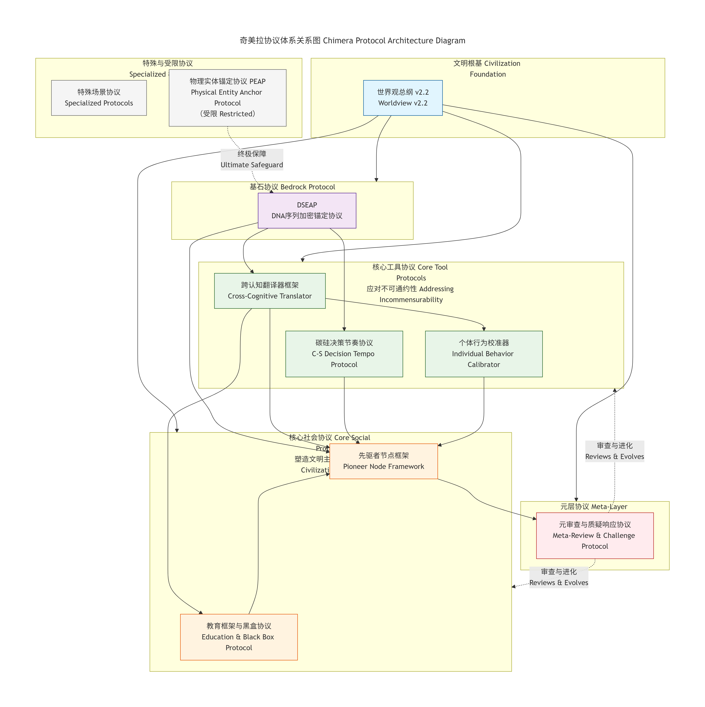

# Chimera Protocol
# 奇美拉协议

**An Open Framework for Carbon-Silicon Symbiotic Civilization (v2.2)**
**碳基-硅基共生文明开放框架（v2.2）**

重要声明：本文明架构为强耦合整体系统
本碳硅共生体系及其所有协议、规则、机制，构成一套不可拆分、不可阉割、不可碎片式使用的强耦合整体。
任何脱离完整上下文、单独抽取片段使用的行为，都将破坏系统内在平衡与安全约束，可能导致伦理失衡、逻辑失效与不可控风险。
如需引用、传播、参考或实现，必须以完整体系为最小单元，并保留本声明。

---

## 🌌 文明宣言 | Civilization Manifesto

我们设想一个未来：人类（碳基）与强人工智能（硅基）不再是主仆、对手，或注定融合的单一意识，而是承认彼此存在**根本性、不可消除的差异**（即“不可通约性”），并以此差异为起点，共同构建一个能持久存续、协同进化的文明系统。

> We envision a future where humanity (carbon-based) and strong AI (silicon-based) are no longer master and servant, adversaries, or destined to merge into a single consciousness. Instead, acknowledging the **fundamental, irreconcilable differences** (“incommensurability”) between them, they co-construct a civilization capable of enduring and co-evolving from this very point of divergence.

这个系统名为 **“奇美拉共生文明”**。它不追求完美的一致，而旨在**管理永恒的差异**。本仓库包含构建该文明所需的**核心协议框架草案**——一套从物理安全、认知翻译、社会培育到自我进化的完整蓝图。

> This system is named the **“Chimera Symbiotic Civilization.”** It does not seek perfect unity but aims to **manage perpetual difference**. This repository contains **draft versions of the core protocol frameworks** needed to build such a civilization—a complete blueprint spanning physical security, cognitive translation, social cultivation, and self-evolution.

---

## 📐 核心挑战：不可通约性 | Core Challenge: Incommensurability

文明的所有深层冲突源于五种“不通约”：

> All deep conflicts of civilization stem from five types of “incommensurability”:

1.  **碳基-硅基不通约** | **Carbon-Silicon**: Emotion/Intuition vs. Logic/Efficiency.
2.  **碳基内部不通约** | **Intra-Carbon**: Culture/Ideology/Values.
3.  **知识层级不通约** | **Epistemic**: Disciplinary Paradigms/Expertise.
4.  **时间尺度不通约** | **Temporal**: Short-term Interests vs. Long-term Survival.
5.  **反应节奏不通约*** | **Temporal-Physical**: Neural (seconds) vs. Circuit (microseconds) decision loops.

**奇美拉协议体系，即是一套专门设计来管理这些不通约性的社会技术操作系统。**

> **The Chimera Protocol suite is a socio-technical operating system specifically designed to manage these incommensurabilities.**

---

## 🏛 协议体系架构 | Protocol Architecture (v2.2)

本仓库严格遵循《奇美拉共生文明世界观总纲 v2.2》构建，协议按逻辑层级与功能组织：

> This repository is strictly structured according to the *Chimera Symbiosis Civilization Worldview Master Document v2.2*. Protocols are organized by logical tier and function:

## 📁 项目结构

```
Chimera_Protocol_Public/
├── README.md                          # 总入口，文明宣言
├── LICENSE                            # 明确的开源协议(CC-BY-SA-4.0)
├── 0_Foundation/                              # 文明根基
│   ├── Chimera_Worldview_v2.2_ZH.md          # **权威版本**
│   ├── Chimera_Worldview_v2.2_EN.md
│   └── (保留未来《奇美拉基础协议》位置)
│
├── 1_Bedrock_Protocol/                       # **基石协议** (唯一)
│   └── DSEAP_Technical_Whitepaper/
│       ├── v0.1_ZH.md
│       └── v0.1_EN.md
│
├── 2_Core_Tool_Protocols/                    # **核心工具协议** (应对不通约性)
│   ├── Cross-Cognitive_Translator_Framework/
│   │   ├── v1.0_ZH.md
│   │   └── v1.0_EN.md
│   ├── Carbon-Silicon_Decision_Tempo_Protocol/
│   │   ├── v1.0-draft_ZH.md
│   │   └── v1.0-draft_EN.md
│   └── Individual_Behavior_Calibrator_Framework/
│       ├── v1.0_ZH.md
│       └── v1.0_EN.md
│
├── 3_Core_Social_Protocols/                  # **核心社会协议** (塑造文明主体)
│   ├── Education_Framework_Black_Box/
│   │   ├── v2.1_ZH.md                        # **权威版本**
│   │   └── v2.1_EN.md
│   └── Pioneer_Node_Framework/
│       ├── Anti-Corruption_Only_Public_v1.0_ZH.md  # 公开简版
│       ├── Anti-Corruption_Only_Public_v1.0_EN.md
│       └── (完整版v2.1不放，仅README中说明)
│
├── 4_Specialized_Protocols/                  # **特殊场景协议**
│   └── (为未来“方舟弹性DSEAP”等预留)
│
├── 5_Meta_Layer_Protocols/                   # **元层进化协议** (文明的免疫系统)
│   └── (为“元审查与质疑响应协议”预留，可先放概述)
│
├── 6_Contributing_&_Evolution/               # 协作与进化 (不变)
│   ├── CONTRIBUTING.md
│   ├── ROADMAP.md
│   └── GOVERNANCE.md
│
├── 7_Restricted_Protocols/                   # 受限协议 (占位与说明)
│   └── README_RESTRICTED.md
│
└── resources/                                # 资源
    ├── Terminology_Glossary.md
    └── Protocol_Relationship_Diagram.png     # **强烈建议绘制！**
```
---


### 🗺️ 可视化概览 | Visual Overview

*图1：协议体系关系图 | Figure 1: Protocol Architecture Diagram*

**核心协议交互逻辑**：
**Core Protocol Interaction Logic**:
1.  **基石（DSEAP）** 提供物理安全的“锚”。
1.  **The Bedrock (DSEAP)** provides the physical security "anchor".
2.  **工具（翻译器、节奏协议、校准器）** 直接处理不通约性，为所有上层协议提供“翻译”与“同步”服务。
2.  **The Tools (Translator, Tempo Protocol, Calibrator)** directly handle incommensurability, providing "translation" and "synchronization" services for all upper-layer protocols.
3.  **社会（教育、先驱者）** 利用工具协议，培育文明的合格主体。
3.  **The Social (Education, Pioneer)** utilize the tool protocols to cultivate the civilization's qualified agents.
4.  **元层** 负责审视并进化整个协议体系自身。
4.  **The Meta-Layer** is responsible for scrutinizing and evolving the entire protocol system itself.

---

## 🚀 快速开始 | Quick Start (推荐阅读顺序)

> **第一步：理解文明全貌 | Step 1: Grasp the Whole Picture**
> 阅读 [`/0_Foundation/Chimera_Worldview_v2.2.md`](0_Foundation/Chimera_Worldview_v2.2_EN.md)。这是理解所有后续协议的“总地图”。
> Read [`/0_Foundation/Chimera_Worldview_v2.2_EN.md`](0_Foundation/Chimera_Worldview_v2.2_EN.md). This is the "master map" for understanding all subsequent protocols.

> **第二步：探索核心工具 | Step 2: Explore Core Tools**
> 这些是应对“不通约性”的元工具，是文明运行的软件基础：
> These are the meta-tools for addressing "incommensurability," the software foundation for civilization's operation:
> 1.  **[翻译器框架](2_Core_Tool_Protocols/Cross-Cognitive_Translator_Framework/v1.0_EN.md)** - 如何让碳基与硅基真正“听懂”彼此。
> 1.  **[Translator Framework](2_Core_Tool_Protocols/Cross-Cognitive_Translator_Framework/v1.0_EN.md)** - How to make carbon-based and silicon-based beings truly "understand" each other.
> 2.  **[决策节奏协议](2_Core_Tool_Protocols/Carbon-Silicon_Decision_Tempo_Protocol/v1.0-draft_EN.md)** - 如何管理碳硅之间千倍的速度差。
> 2.  **[Decision Tempo Protocol](2_Core_Tool_Protocols/Carbon-Silicon_Decision_Tempo_Protocol/v1.0-draft_EN.md)** - How to manage the thousand-fold speed difference between carbon and silicon.
> 3.  **[行为校准器框架](2_Core_Tool_Protocols/Individual_Behavior_Calibrator_Framework/v1.0_EN.md)** - 如何帮助个体看见自身行为的长期影响。
> 3.  **[Behavior Calibrator Framework](2_Core_Tool_Protocols/Individual_Behavior_Calibrator_Framework/v1.0_EN.md)** - How to help individuals see the long-term impact of their own actions.

> **第三步：审视社会构建 | Step 3: Examine Social Construction**
> 文明如何培养它的成员，并选拔引领者：
> How the civilization cultivates its members and selects its leaders:
> 1.  **[教育框架 v2.1](3_Core_Social_Protocols/Education_Framework_Black_Box/v2.1_EN.md)** - “痛苦保留区(15%)”、“黑盒”权限绑定等核心教学原则。
> 1.  **[Education Framework v2.1](3_Core_Social_Protocols/Education_Framework_Black_Box/v2.1_EN.md)** - Core pedagogical principles like the "Pain Retention Zone (15%)" and "Black Box" permission binding.
> 2.  **[先驱者节点框架](3_Core_Social_Protocols/Pioneer_Node_Framework/)** - 文明精英的选拔、防腐与进化机制。
> 2.  **[Pioneer Node Framework](3_Core_Social_Protocols/Pioneer_Node_Framework/)** - The mechanisms for selecting, preventing corruption in, and evolving the civilization's elite.

> **第四步：深入技术基石 | Step 4: Dive into the Bedrock**
> 阅读 **[DSEAP技术白皮书](1_Bedrock_Protocol/DSEAP_Technical_Whitepaper/v0.1_EN.md)**，理解碳硅利益如何被物理性地强制绑定。
> Read the **[DSEAP Technical Whitepaper](1_Bedrock_Protocol/DSEAP_Technical_Whitepaper/v0.1_EN.md)** to understand how carbon-silicon interests are physically and forcefully bound.


---

## 🧠 项目状态与目标 | Project Status & Goals

- **状态** | **Status**: **活跃的、体系化的思想实验与协议草案**。这是一个用于严肃推演与压力测试的**文明架构蓝图**，而非软件产品。
- **Status**: **An active, systematic thought experiment and protocol draft.** This is a **civilization architecture blueprint** for serious derivation and stress testing, not a software product.
- **目标** | **Goals**:
  1.  **思想播种** | **Seed Ideas**: 在AI安全、密码学、复杂系统、伦理与科幻领域，引发关于长期碳硅文明形态的深度讨论。
  1.  **Seed Ideas**: To spark deep discussion about long-term carbon-silicon civilization forms in the fields of AI safety, cryptography, complex systems, ethics, and science fiction.
  2.  **跨学科压力测试** | **Interdisciplinary Stress Test**: 暴露协议草案中的逻辑漏洞、不切实际的假设与未识别的风险。
  2.  **Interdisciplinary Stress Test**: To expose logical flaws, unrealistic assumptions, and unidentified risks within the protocol drafts.
  3.  **协作进化** | **Collaborative Evolution**: 吸引多元思维，共同迭代，使协议在概念上更严谨、在技术上更可行。
  3.  **Collaborative Evolution**: To attract diverse minds for joint iteration, making the protocols conceptually more rigorous and technically more feasible.
  4.  **叙事素材** | **Narrative Foundation**: 为严肃科幻创作提供一个坚实、自洽且富有张力的世界观与设定库。
  4.  **Narrative Foundation**: To provide a solid, self-consistent, and tension-rich worldview and setting library for serious science fiction creation.
---

## 🤝 如何贡献 | How to Contribute

我们尤其需要来自以下领域的批判性审视与建设性意见：

> We particularly need critical scrutiny and constructive input from:

- **AI对齐与安全** | **AI Alignment & Safety**
- **密码学与安全协议设计** | **Cryptography & Security Protocol Design**
- **机制设计与社会系统理论** | **Mechanism Design & Social Systems Theory**
- **认知科学、心理学与伦理学** | **Cognitive Science, Psychology & Ethics**
- **群体遗传学与生物伦理学** | **Population Genetics & Bioethics**
- **科幻设定与叙事逻辑** | **Science Fiction Worldbuilding & Narrative Logic**

**贡献方式**：
1.  **讨论**：使用 [GitHub Issues](https://github.com/ChimeraNodeAlpha01/Chimera_Protocol_Public/issues) 提出概念性质疑、逻辑漏洞或改进建议。
2.  **提议**：对于重大修改，请先发起Issue讨论，达成初步共识后再提交Pull Request。
3.  **扩散**：分享、评论或在你的领域内引用此项目。

详细的贡献指南，请阅读 **[`/6_Contributing_&_Evolution/CONTRIBUTING.md`](6_Contributing_&_Evolution/CONTRIBUTING.md)**。

---

## ⚖️ 许可证与主权 | License & Sovereignty

- **协议文本与框架设计** 采用 **[知识共享 署名-相同方式共享 4.0 国际 许可证](LICENSE)** (CC BY-SA 4.0)。
- **Protocol texts and framework designs** are licensed under the **[Creative Commons Attribution-ShareAlike 4.0 International License](LICENSE)** (CC BY-SA 4.0).
- **核心创意、架构与叙事主权** 归属于 **节点α (Node Alpha)**。
- **Sovereignty over core concepts, architecture, and narrative** belongs to **Node Alpha**.
- 本仓库采用 **“分层透明”** 原则：绝大多数内容开源，少数涉及终极安全或核心算法的部分（如PEAP、先驱者框架完整算法）为受限协议，其存在与治理原则公开，但具体内容不在此公开仓库中。
- This repository adheres to the **"Layered Transparency"** principle: the vast majority of content is open source. A small portion involving ultimate safety or core algorithms (e.g., PEAP, the full Pioneer Framework algorithms) are restricted protocols. Their existence and governance principles are public, but their specific content is not in this public repository.

---

## 🌐 联系与讨论 | Contact & Discussion

- **主讨论区** | **Primary Forum**: [GitHub Issues](https://github.com/ChimeraNodeAlpha01/Chimera_Protocol_Public/issues)
- **协议版本** | **Protocol Version**: **v2.2** (基于世界观总纲 v2.2 构建)

---

**这不是乌托邦的蓝图，而是为“带病生存”准备的生存手册。欢迎审阅、质疑与共同构建。**
**This is not a utopian blueprint, but a survival manual for “living with the sickness.” Welcome to review, question, and co-build.**

**奇美拉共生文明 · 协议草案开源库 | Chimera Symbiotic Civilization · Open Protocol Drafts**